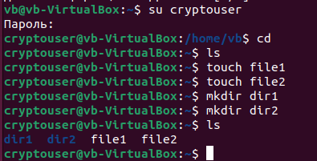
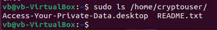
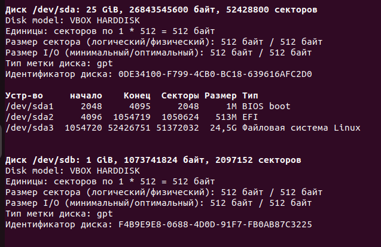
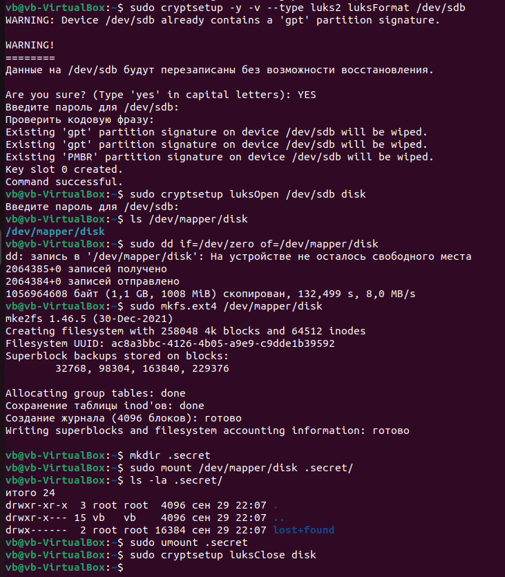

# Домашнее задание к занятию  «Защита хоста» - Жаринов Павел

## Задание 1

1. Установите **eCryptfs**.
2. Добавьте пользователя cryptouser.
3. Зашифруйте домашний каталог пользователя с помощью eCryptfs.

```bash
sudo apt update
sudo apt install -y ecryptfs-utils

sudo adduser cryptouser
su cryptouser
#создал файлы и папки
exit
sudo ecryptfs-migrate-home -u cryptouser
```



---

## Задание 2

1. Установите поддержку **LUKS**.
2. Создайте небольшой раздел, например, 100 Мб. ( создал на 1гб)
3. Зашифруйте созданный раздел с помощью LUKS.


